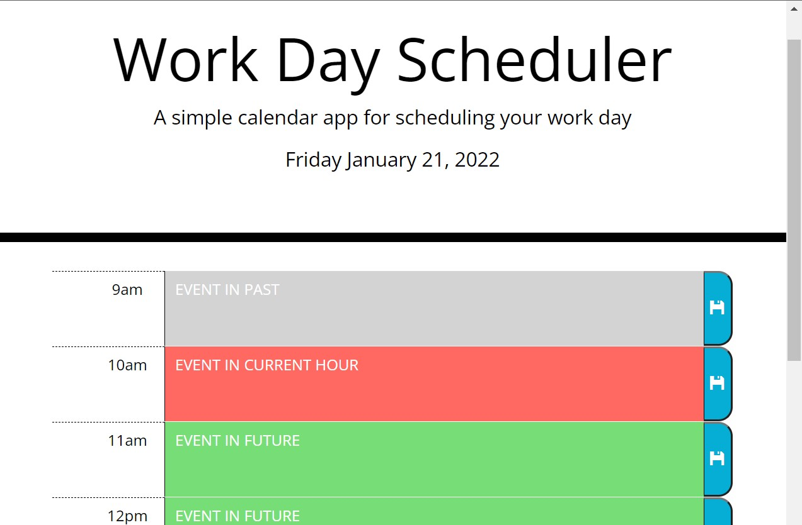

# Module-5-Challenge-Submission

## Description

This project is designed to be a single work day, hourly scheduler. Users are able to update and save events in local storage. Events are color coded to show if the events on the scheduler are in the past, present or future hours. Moment.js is used to update the current date, keep track of the current time, and update the scheduler every five minutes without having to refresh the page.

## Work Day Scheduler
[Click Here](https://lrodenyoder.github.io/work-day-scheduler/) to go to the scheduler.

  

## Sources

* Save Icon: [Link](https://www.codesprogram.com/icons/bootstrap-glyphicon-floppy-disk)

## License

MIT License

Copyright (c) [2022] [Lauren Yoder]

Permission is hereby granted, free of charge, to any person obtaining a copy
of this software and associated documentation files (the "Software"), to deal
in the Software without restriction, including without limitation the rights
to use, copy, modify, merge, publish, distribute, sublicense, and/or sell
copies of the Software, and to permit persons to whom the Software is
furnished to do so, subject to the following conditions:

The above copyright notice and this permission notice shall be included in all
copies or substantial portions of the Software.

THE SOFTWARE IS PROVIDED "AS IS", WITHOUT WARRANTY OF ANY KIND, EXPRESS OR
IMPLIED, INCLUDING BUT NOT LIMITED TO THE WARRANTIES OF MERCHANTABILITY,
FITNESS FOR A PARTICULAR PURPOSE AND NONINFRINGEMENT. IN NO EVENT SHALL THE
AUTHORS OR COPYRIGHT HOLDERS BE LIABLE FOR ANY CLAIM, DAMAGES OR OTHER
LIABILITY, WHETHER IN AN ACTION OF CONTRACT, TORT OR OTHERWISE, ARISING FROM,
OUT OF OR IN CONNECTION WITH THE SOFTWARE OR THE USE OR OTHER DEALINGS IN THE
SOFTWARE.